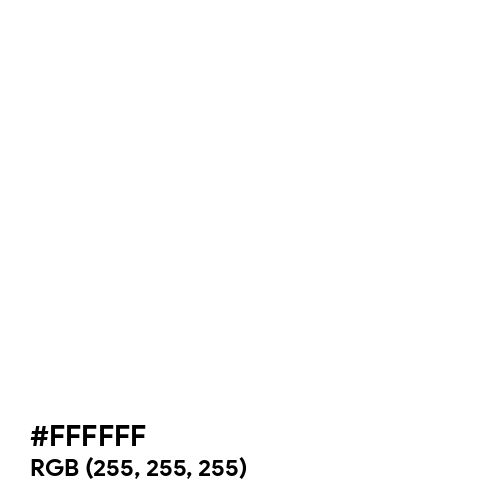
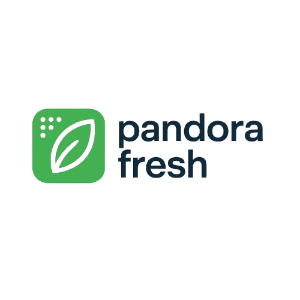

# **CAPÍTULO IV: PRODUCT DESIGN**
## 4.1. Style Guidelines
En esta sección, presentaremos el concepto de diseño para la página web y la aplicación, de modo que nuestros usuarios tengan una interfaz amigable y funcional. Con este propósito, hemos optado por utilizar elementos visuales que sean amigables y atractivos a la vista.

### 4.1.1. General Style Guidelines
Nuestra paleta de colores se ha diseñado para reflejar la frescura, confiabilidad y modernidad que representa Pandora's Fresh en la gestión de productos perecibles. Los colores seleccionados transmiten profesionalismo, claridad y la esencia de frescura que caracteriza a nuestra marca.

Chromatic Colors
#1cb4d4 (Azul Confianza - Secundario)
Este azul vibrante representa confianza y profesionalismo, ideal para elementos interactivos como botones y llamadas a la acción. Transmite la seriedad y eficiencia que los usuarios esperan de una herramienta de gestión profesional.

  

#00bab3 (Turquesa Frescura - Acento)
Este tono turquesa evoca frescura y vitalidad, representando perfectamente la naturaleza perecible de los productos que gestionamos. Se utiliza para resaltar acciones importantes y elementos que requieren atención especial.

  

#071d49 (Azul Profesional - Oscuro)
Un azul marino profundo que aporta seriedad y contraste. Perfecto para encabezados y elementos que requieren jerarquía visual, transmitiendo la confiabilidad y seguridad que ofrece nuestra plataforma.

  

Background Colors
#ccedfc (Azul Claridad - Primario)
Un azul claro que sugiere transparencia y claridad en la gestión de productos. Funciona como fondo principal, creando una sensación de limpieza y espacio que facilita la visualización de la información.

  

#ffffff (Blanco Pureza - Luz)
Blanco puro que representa la pureza e higiene necesaria en el manejo de productos perecibles. Se utiliza como fondo secundario y para elementos que necesitan máximo contraste.

  

**Typography: Sans Serif**

Utilizamos dos familias tipográficas que complementan perfectamente los valores de Pandora's Fresh:

Big Shoulders
Una tipografía condensada y moderna que aporta fuerza y presencia visual. Ideal para titulares y elementos que requieran impacto.

 
 Big Shoulders - Impacto Visual 
 

Montserrat
Una tipografía sans-serif limpia y altamente legible, perfecta para textos largos y contenido de interfaz.

### Jerarquía tipográfica:

Big Shoulders Bold (700): Títulos principales y encabezados destacados

Big Shoulders Medium (500): Subtítulos y elementos de navegación

Montserrat Regular (400): Cuerpo de texto principal

Montserrat Light (300): Textos secundarios y descripciones

### 4.1.3. Iconography
El logotipo de Pandora's Fresh representa perfectamente nuestra esencia:

  

El diseño del logotipo combina elementos modernos y orgánicos que comunican:

Frescura: Las líneas fluidas y orgánicas representan productos frescos y naturales

Tecnología: La tipografía moderna y estructurada refleja nuestro enfoque tecnológico

Confianza: La combinación equilibrada transmite profesionalismo y confiabilidad

### 4.1.4. Component Styles
Botones
Botón primario: Fondo #1cb4d4, texto blanco, bordes redondeados de 8px

Botón secundario: Fondo transparente, borde #1cb4d4 2px, texto #1cb4d4

Botón de acento: Fondo #00bab3, texto blanco, para acciones destacadas

### Tarjetas
Sombra suave (0 4px 12px rgba(7, 29, 73, 0.1)), fondo blanco, bordes redondeados de 12px, y uso estratégico de colores de la paleta.

### Formularios
Campos con bordes sutiles (#ccedfc), etiquetas en #071d49 con Montserrat Medium, y focos destacados con borde #00bab3.

### 4.1.5. Uso de Espacios y Layout
Sistema de rejilla de 12 columnas con espaciado consistente basado en múltiplos de 8px:

Margen entre secciones: 64px

Padding interno: 24px

Espaciado entre elementos: 16px

Radio de bordes: 8px

Esta guía de estilos asegura una experiencia coherente y profesional en toda la plataforma Pandora's Fresh, reforzando los valores de confiabilidad, frescura y eficiencia que representamos.

### 4.1.2. Web Style Guidelines

Las guías de estilo web de Pandora's Fresh han sido desarrolladas con el objetivo de ofrecer una experiencia óptima y coherente en todos los dispositivos. Nuestra plataforma está diseñada bajo los principios del Web Responsive Design, lo que garantiza que cada elemento de la interfaz se adapte fluidamente a distintos tamaños de pantalla, desde teléfonos móviles hasta monitores de escritorio.

Uno de los pilares visuales de nuestra interfaz es la implementación del patrón de diseño en forma de Z, el cual guía de manera intuitiva la mirada del usuario a lo largo de la página. Este flujo comienza en la esquina superior izquierda, atraviesa el contenido principal y finaliza en la esquina inferior derecha.

Este recorrido natural permite que la navegación sea clara y eficiente, facilitando el acceso a información clave como monitoreo de productos, alertas de caducidad y gestión de inventarios. El diseño adaptable y el uso estratégico del patrón en Z aseguran que, sin importar el dispositivo utilizado, la experiencia de usuario sea constante y centrada en las necesidades de restaurantes, mercados y proveedores.

Estas directrices no solo definen la estética de Pandora's Fresh, sino que también refuerzan nuestro compromiso con un entorno digital accesible, eficiente y orientado a la optimización de la gestión de productos perecibles.
## 4.2. Information Architecture

### 4.2.1. Organization Systems

- Sistemas de Organización Visual:

Organización secuencial: Se utilizará este tipo de sistema para explicar la información sobre la plataforma web de forma consecutiva. Así el usuario podrá ir conociendo paso a paso el funcionamiento de la aplicación a través del Landing Page, dirigiéndolo a cada sección en orden para conocer desde la introducción de la aplicación web, el equipo que conforma el startup, nuestras funcionalidades, beneficios hasta demostraciones de uso y formas de contacto.

- Esquemas de Categorización de Contenido:

Por tópicos: El diseño de la Landing Page se divide por tópicos que distribuyen los diferentes temas a tratar de nuestra plataforma, presentando cada tópico de manera individual en una sección donde se explicará con detalle la información necesaria para el uso de la plataforma en diferentes aspectos.
### 4.2.2. Labeling Systems

En la Landing Page, se ha hecho uso de etiquetas con un lenguaje sencillo que indican de manera clara al usuario la funcionalidad de cada una:

- Inicio: Muestra información principal y resumida de nuestra aplicación web.

- Acerca de Nosotros: Presenta al equipo y la misión de Pandora's Fresh.

- Funcionalidades: Explica las características principales de la plataforma.

- Beneficiados: Describe los segmentos de usuarios que se benefician de nuestra solución.

- Testimonios: Muestra experiencias de usuarios actuales.

- Soporte: Proporciona acceso a ayuda y contacto.

- Descarga: Incluye botones de descarga para iOS y Android.

- Empezar Ahora: Call to action principal para registro inmediato.

### 4.2.3. SEO Tags and Meta Tags

**Landing Page:** 

- Title: Pandora's Fresh - Gestión Inteligente de Productos Perecibles

- Meta Description: Plataforma de gestión inteligente para productos perecibles que ayuda a restaurantes y mercados a reducir desperdicios y optimizar inventarios.

- Keywords: gestión de inventarios, productos perecibles, reducción de desperdicios, sensores IoT, restaurantes, mercados, alertas de caducidad, optimización de stock

- Author: Turing Almost Completed

### 4.2.4. Searching Systems

**Aplicación Web:** 
Los usuarios registrados tendrán acceso a diferentes sistemas de búsqueda:

- Restaurantes:

Búsqueda de productos por proximidad de caducidad

- Filtrado de inventario por categorías

Búsqueda de alertas y notificaciones

- Mercados y Proveedores:

Búsqueda de productos por estado de frescura

Filtrado por fechas de entrada y salida

Búsqueda de reportes y analytics

### 4.2.5. Navigation Systems

**Landing Page:** La navegación está diseñada para ser intuitiva y eficiente:

Header fijo con menú de navegación principal

Navegación por anclajes a secciones específicas

Menú móvil optimizado para dispositivos táctiles

Botones Call to Action estratégicamente ubicados

Footer completo con enlaces importantes y información de contacto

**Aplicación Web:**

Dashboard personalizado según tipo de usuario

Menú lateral con acceso rápido a todas las funcionalidades

Breadcrumbs para facilitar la navegación contextual

Barra de búsqueda global en todas las secciones

Notificaciones y alertas accesibles desde cualquier pantalla

Esta arquitectura de información asegura que los usuarios puedan encontrar rápidamente lo que necesitan, tanto en la landing page de información como en la aplicación web funcional, manteniendo una experiencia coherente y alineada con los objetivos de negocio de Pandora's Fresh.